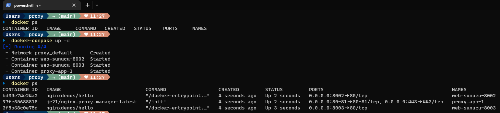
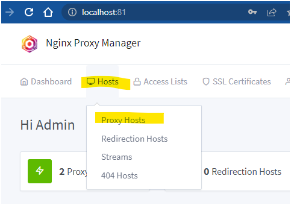
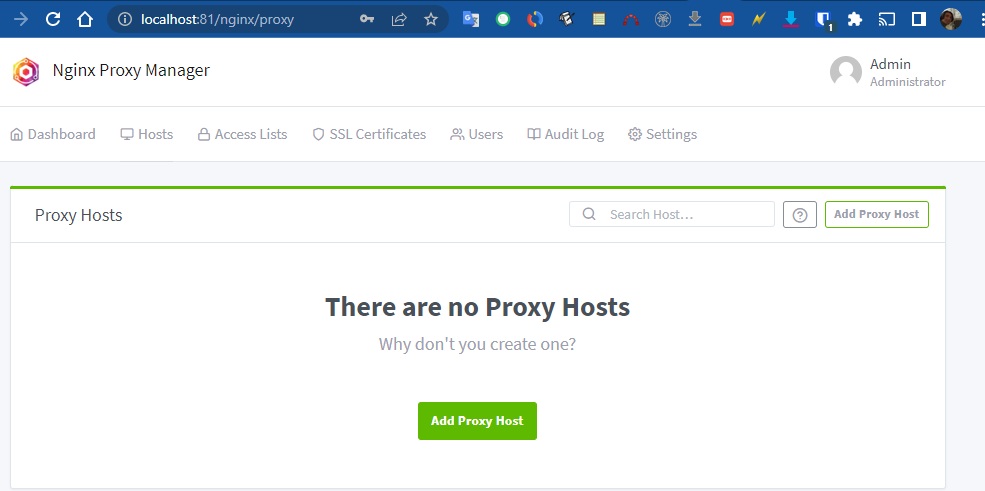
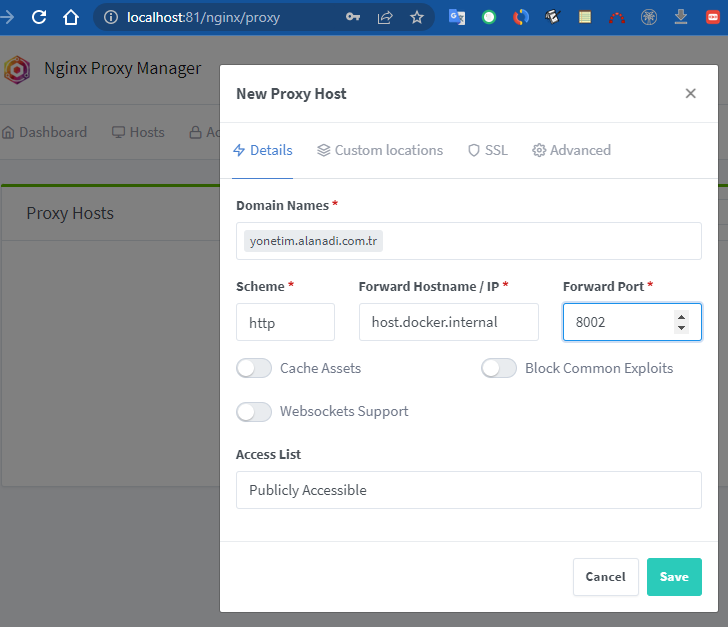
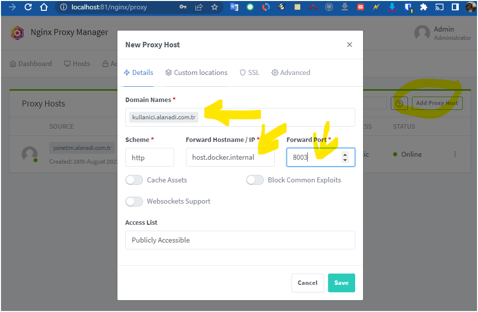
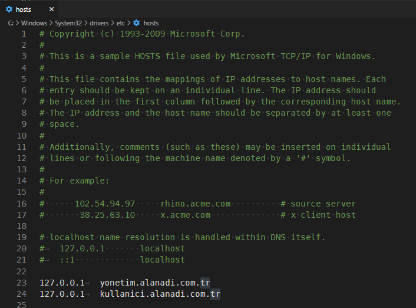
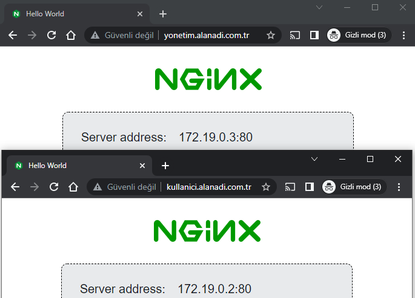

# Nasıl çalışır?




## Proxy Host Tanımları



Örneğin bir alt alan adımız yönetimin, diğeri ise kullanıcıların erişiminde olacak iki farklı adresi işaret etsin.
8002 Portunda çalışan web sunucumuz yonetim.alanadi.com.tr adresine hizmet versin.


8003 Portunda çalışan web sunucumuz kullanici.alanadi.com.tr adresine hizmet versin.


Hedef sunucu adresi olarak host.docker.internal adresini kullanıyoruz çünkü windows üstünde çalışan docker desktop ile windows makinasına erişmek için bu adı kullanmalıyız.
Eğer nginx proxy management konteyneri için --network=host ayarını yapmış olsaydık bu kez 127.0.0.1 adresini göstermemiz yeterli olacaktı.

## İsimden IP'ye Gidebilmek için hosts Dosyası Ayarı

```shell
127.0.0.1	yonetim.alanadi.com.tr
127.0.0.1	kullanici.alanadi.com.tr
```



## Görüntüleme




